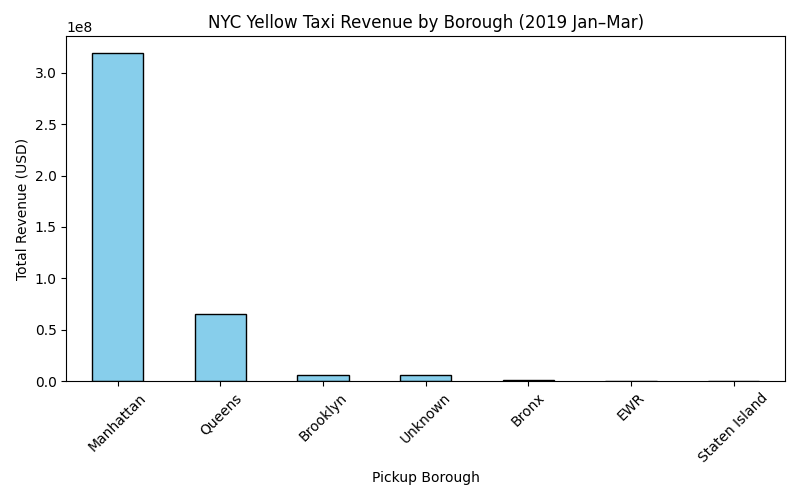

# NYC Taxi Big Data Pipeline (Spark + Local Parquet)

End-to-end data engineering project using **PySpark** to ingest, clean, enrich, and aggregate **22.5M+ NYC Yellow Taxi trips (2019)**.  
Outputs are written as **partitioned Parquet** and a curated **borough revenue** table suitable for analytics or BI.

## 🧱 Tech
- PySpark (3.5.x), OpenJDK 11
- Local Parquet lake (`out/processed`, `out/curated`)
- Optional: AWS S3 + Glue + Athena (same folder layout)
- Optional: Pandas/Matplotlib for quick visuals

## 📂 Project Structure
├── job.py # ETL: CSV -> cleaned Parquet (processed + curated daily KPIs)
├── transforms.py # cleaning & KPI transforms
├── schemas_2019.py # explicit schema for 2019 yellow taxis
├── borough_monthly.py # enrichment (TLC lookup) + monthly revenue by pickup borough
├── read_yellow_2019.py # quick schema/row preview
├── taxi+_zone_lookup.csv # TLC zone -> borough lookup
└── out/
├── processed/yellow/year=2019/month=01..03/...
├── curated/yellow_daily/year=2019/month=01..03/...
└── curated/borough_monthly/year=2019/month=01..03/...


## 🚀 Quick Start

### 1) Create venv & install PySpark
```bash
python -m venv .venv
source .venv/bin/activate
pip install pyspark==3.5.1


macOS: ensure Java 11 is installed and available
export JAVA_HOME="/opt/homebrew/opt/openjdk@11/libexec/openjdk.jdk/Contents/Home"

2) Put data files next to the code

yellow_tripdata_2019-01.csv, -02.csv, -03.csv

taxi+_zone_lookup.csv (Kaggle TLC lookup)

3) Run the ETL
python job.py "yellow_tripdata_2019-0*.csv" out/processed/yellow out/curated/yellow_daily

4) Enrich + Aggregate (pickup borough revenue)
python borough_monthly.py


Outputs:

Parquet: out/curated/borough_monthly/year=2019/month=01..03/

CSV (if pandas installed): borough_revenue_2019.csv

Or Spark-native CSV (no pandas): out/exports/borough_revenue/part-*.csv

✅ What’s Included
Cleaning Highlights

Timestamp parsing + validity window (clamps weird years)

Outlier filtering: trip_distance <= 200, total_amount <= 1000

Partitions: year, month from pickup timestamp

Curated Datasets

Daily KPIs (out/curated/yellow_daily): trips, passengers, total_miles, revenue, median_fare by day

Monthly Borough Revenue (out/curated/borough_monthly): revenue, trips, avg_miles, avg_fare by pickup borough

Key Insight (2019 Jan–Mar sample)

Manhattan ≈ $1.2B revenue (~65% of total); Queens and Brooklyn follow, Bronx much smaller.

Likely driven by Manhattan core + airport flows.

🗂 Spark-Native CSV Export (no pandas)

If you don’t want pandas, use this inside borough_monthly.py (already safe to paste):

# Spark-native CSV export (no pandas)
(monthly_pickup
    .orderBy(F.desc("revenue"))
    .coalesce(1)  # single shard for convenience
    .write.mode("overwrite")
    .option("header", True)
    .csv("out/exports/borough_revenue"))
